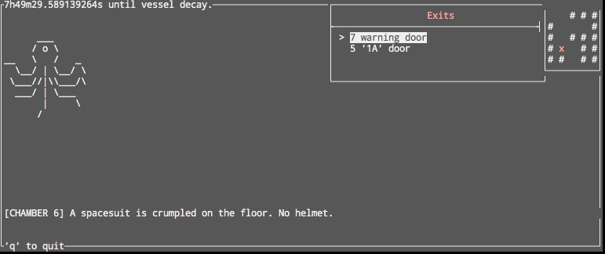

```
 ▌ ▐·▄▄▄ ..▄▄ · .▄▄ · ▄▄▄ .▄▄▌
 ▪█·█▌▀▄.▀·▐█ ▀. ▐█ ▀. ▀▄.▀·██•
 ▐█▐█•▐▀▀▪▄▄▀▀▀█▄▄▀▀▀█▄▐▀▀▪▄██▪
  ███ ▐█▄▄▌▐█▄▪▐█▐█▄▪▐█▐█▄▄▌▐█▌▐▌
  . ▀   ▀▀▀  ▀▀▀▀  ▀▀▀▀  ▀▀▀ .▀▀▀
```



# dev notes

[go-bindata](https://github.com/jteeuwen/go-bindata) is used to manage
assets which live in `/data`.

To regenerate: `go-bindata -o bindata/bindata.go -pkg bindata data/`
